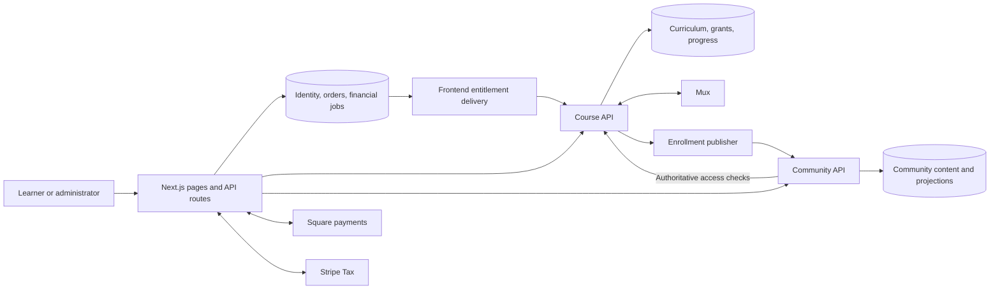

# Unified Course and Community Platform Integration Plan

Build one account-based learning platform in `lash-her-frontend`, backed by the Course API for education and access, and the Community API for course-linked discussion.

The agreed launch scope is:

- Unified free and paid courses, replacing the current Sanity short-course implementation.
- Google and passwordless email-link sign-in.
- Free enrollment with optional, separate marketing consent.
- International paid-course sales through Square, charged in CAD, with eligible Afterpay transactions.
- Stripe Tax for international tax calculation and reporting.
- Practice and graded quizzes.
- Course communities with profiles, posts, comments, reactions, images, reporting, moderation, and in-app notifications.
- Course authoring and operational tools within the existing frontend `/admin` area.
- Vercel frontend hosting and Render API hosting, with a documented migration path to AWS.

Work is grouped by implementation owner below. The category order is not the delivery order; the shared delivery sequence and release gates are in category 4. Frontend work includes its Next.js server routes, private database, commerce, and background delivery logic.

**Live execution tracker:** [API-INTEGRATION-EXECUTION.md](/Users/dardan/workspace/lash-her-frontend/API-INTEGRATION-EXECUTION.md) is the shared source for task order, dependencies, current status, completion evidence, and the next action. Read it before starting integration work and update it after each completed item, failed verification, blocker, or dependency change. Keep execution status in that single frontend-owned document rather than separate repository copies.

This plan defines implementation scope. Keep its copies in the frontend, Course API, and Community API repositories synchronized when scope changes; update the tracker's task mapping and dependencies in the same change.

## 1. Community API related work

**Repository:** `/Users/dardan/workspace/lash-her-community-api`

**Ownership:** member profiles, spaces, discussions, moderation, notifications, media processing, and the enrollment projection. The existing API already supplies the enrollment-event receiver, ordered projection, repair, reconciliation, and authoritative Course access-check integration; the member-facing domain must be built.

### Authentication, authorization, and integration contracts

- Accept immutable frontend `customer_users.id` UUIDs as member identities. Verify server-issued, short-lived member and administrator JWTs with the correct credentials, canonical subject, issuer, audience, issue/expiry times, bounded lifetime, and overlapping keys for rotation.
- Enforce the explicit community-moderator capability inside the API; frontend authorization alone is insufficient.
- Retain separate credentials for receiving Course enrollment events and reading Course authority. Continue the existing ordered enrollment projection, repair, and reconciliation integration.
- Handle frontend account suspension, export, and deletion through durable authenticated commands, preserving required audit records. Keep account lifecycle enforcement distinct from community participation suspensions.
- Maintain the Community OpenAPI contract consumed by the frontend's generated, runtime-validated adapter. Application schema changes and migrations remain in the Community repository.

### Community domain, access enforcement, media, and notifications

- Add profiles, one enabled space per course, posts, comments, reactions, reports, moderation actions, notifications, and media-processing jobs.
- Support chronological feeds, cursor pagination, course-scoped search, post editing/deletion, comment threads, and pinned/locked discussions.
- Restrict profiles and member discovery to appropriate shared course spaces. Never expose login email, phone, payment information, or private enrollment history.
- Use enrollment projections for discovery and synchronization. Require the existing online Course authority check for protected content reads, posting, reactions, member access, and media authorization.
- Obtain the protected course ID from the stored resource. Never accept a client-supplied course ID as proof that a post or attachment is accessible.
- Preserve the 1.5-second authority timeout and fail closed when Course is unavailable. A stale positive projection must not override denial.
- Apply community suspensions independently of course enrollment. Moderators can hide/restore content, resolve reports, lock threads, and suspend participation, with required reasons and audit records.
- Use text plus JPEG/PNG/WebP images at launch: maximum five images per post and 10 MB per original image.
- Store originals in a private S3 quarantine area. Verify content, re-encode approved images, strip metadata, and expose only processed assets through short-lived authorized URLs. Run orphan cleanup and deletion asynchronously.
- Provide in-app notifications for replies and moderation outcomes, unread counts, preferences, and read-state updates. Use bounded polling initially.
- Introduce per-principal distributed quotas. Existing IP-based limits must not treat every learner behind the Vercel server as one person.

### Dependencies

- Course owns final access decisions and publishes transactional enrollment transitions for purchases, free enrollments, imports, and administrator changes. Active course enrollment includes access to that course’s enabled community.
- Frontend owns sign-in, token issuance, community screens, and same-origin request handlers.
- Infrastructure deploys the Community API, repair/reconciliation worker, media worker, private S3 storage, and monitoring. Category 4 defines deployed acceptance and recovery evidence.

## 2. Course API related work

**Repository:** `/Users/dardan/workspace/lash-her-course-api`

**Ownership:** curriculum, quizzes, grants, learning progress, Mux integration, and final course-access decisions. Extend the existing catalog/curriculum management, entitlement ledger, student content, signed playback, progress, administrator access operations, and reconciliation.

### Authentication, authorization, and integration contracts

- Accept immutable frontend `customer_users.id` UUIDs as learner identities. Verify server-issued, short-lived learner and administrator JWTs with the correct credentials, canonical subject, issuer, audience, issue/expiry times, bounded lifetime, and overlapping keys for rotation.
- Enforce explicit course-editor and course-support capabilities inside the API; frontend authorization alone is insufficient.
- Retain separate credentials for frontend entitlement commands, Course enrollment publication, and Community authority reads.
- Handle frontend account suspension, export, and deletion through durable authenticated commands, preserving required audit records.
- Maintain the Course OpenAPI contract consumed by the frontend's generated, runtime-validated adapter. Application schema changes and migrations remain in the Course repository.

### Catalog and authoring

- Add course covers, SEO metadata, structured lesson content, transcripts, caption references, and course-specific tax classification.
- Preserve the existing Portable Text lesson structure during import, storing a validated, versioned document in Course PostgreSQL.
- Add paginated catalog/admin collections, individual admin course retrieval, transactional curriculum reordering, and optimistic concurrency checks.
- Add lesson/module archival and safe media replacement. Preserve identifiers and historical activity; avoid deleting content referenced by progress or audit records.
- Validate publication: valid slug, supported currency, price/access mode, complete required content, valid quizzes, and ready media.
- Make CAD the launch currency. Existing USD defaults must not silently create purchasable courses.
- Keep existing lifecycle behavior explicit: drafts are hidden; archived courses remain identifiable in learner history but cannot provide active learning content.

### Enrollment and access

- Add authenticated, idempotent free enrollment for published zero-price courses.
- Record free enrollment as an orderless grant with an explicit source. Extend the shared idempotency namespace and ledger constraints; do not fabricate orders or payments.
- Emit Course-to-Community enrollment transitions transactionally for free enrollments, purchases, imports, and administrator changes.
- Preserve existing order-scoped refund revocation and independent manual grants.
- Apply the same effective-access rules to content, playback, quizzes, progress, and Community authority checks, including concurrent revocation and expired grants.

### Quizzes and progress

- Add revisioned quizzes, questions/options, immutable attempts, server-side grading, and derived completion.
- Preserve imported courses as practice mode: a fully answered attempt completes the lesson regardless of score.
- New graded quizzes default to an 80% pass threshold, configurable by editors, with unlimited retries. Retain historical attempts when a quiz changes.
- Prevent generic progress endpoints from marking graded lessons complete without a qualifying attempt.
- Track resume position separately from maximum watched position. Protect against delayed heartbeats overwriting newer progress.
- Keep completion/progress scoped to the authenticated learner. Imported browser progress must never grant access or satisfy graded assessments.

### Video lifecycle

- Complete upload status, retry, replacement, caption, and signed-thumbnail support.
- Verify duplicate and reordered Mux webhooks, failed uploads, deleted assets, and late events for replaced videos.
- Add periodic recovery for stuck processing states and orphaned uploads.
- Preserve the existing 600-second playback-token lifetime. Renew only after rechecking access; existing tokens may remain usable until expiry after revocation.

### Free-course content and media migration

- Build a repeatable dry-run/import process with a durable mapping from Sanity document/module/question keys to Course UUIDs.
- Import titles, slugs, introductions, rich text, quizzes, feedback, images, captions, transcripts, SEO, and video references. Import as free practice courses.
- Transfer media ownership deliberately. Reuse assets only where environment and ownership permit; otherwise import them into the Course-managed Mux environment.
- Verify signed playback before retiring old delivery paths. Existing public media URLs remain public until explicitly retired; changing the application alone cannot make them private.
- Provide the validated practice-progress import support used by the signed-in frontend flow. Imported browser state never establishes identity, grants access, or satisfies a graded assessment.

### Dependencies

- Frontend owns customer identity, free-enrollment UI, authoring UI, payment collection, and payment-to-entitlement delivery. Course handles the corresponding authenticated API operations and access decisions.
- Community consumes Course enrollment events and performs online authority checks. Course’s Community enrollment publisher remains separate from the frontend entitlement outbox.
- Infrastructure deploys the API, enrollment publisher, snapshot worker, migration jobs, and media recovery scheduling. Follow the protected migration policy resolved in P0-02 before production CD.

## 3. Frontend related work

**Repository:** `/Users/dardan/workspace/lash-her-frontend`

**Ownership:** customer identity, orders, payment-provider events, tax records, customer email, payment-to-entitlement delivery, public/learner/community pages, and administration screens. Extend the existing Auth.js administrator login, Square commerce, operational PostgreSQL, and Sanity free-course implementation.

### Customer identity and authorization

- Add frontend PostgreSQL customer accounts, provider links, verification tokens, and customer sessions. Use immutable `customer_users.id` UUIDs across both APIs.
- Implement a customer Auth.js configuration with Google and Resend email links. Keep administrator authentication, cookies, and authorization isolated so adding customer login cannot weaken existing admin access.
- Use database-backed customer sessions, single-use email tokens with a 15-minute lifetime, login throttling, safe return URLs, and generic email-request responses. Auth.js email login requires database persistence. [Auth.js Resend documentation](https://authjs.dev/getting-started/providers/resend)
- Require proof of control before linking another provider to an existing account. Never merge identities from submitted email addresses or course-signup records.
- Require only necessary account information. Preserve existing marketing contact details and consent history without automatically subscribing learners.
- Mint server-only, short-lived API JWTs with separate audiences and credentials for Course learners, Community members, and administrator operations. Require canonical subjects, issuer, audience, issue/expiry times, bounded lifetime, and overlapping verification keys for rotation.
- Retain separate service credentials for frontend entitlement commands, Course enrollment publication, and Community authority reads.
- Map current frontend staff permissions into explicit course-editor, course-support, and community-moderator capabilities. Enforce capabilities inside each API as well as the frontend.
- Add account suspension, session revocation, export, and deletion workflows. Coordinate downstream cleanup through durable authenticated commands while preserving required financial and audit records.

### Frontend pages and service adapters

- Preserve `/courses/[slug]` as the canonical public course URL and add a unified `/courses` catalog.
- Add `/academy` for enrolled courses and continuation, lesson/player routes, `/community` and course discussion routes, and `/account` for identity and preferences.
- Add course, enrollment-support, and community-moderation screens under `/admin`.
- Create server-only Course and Community adapters using generated OpenAPI types and runtime response validation.
- Add explicit same-origin `/api/academy/**` and `/api/community/**` handlers. Do not create an unrestricted proxy to arbitrary upstream paths.
- Authenticate every protected operation, validate input, apply CSRF protection to cookie-authenticated mutations, propagate safe request IDs, and translate API errors into stable UI states.
- Cache public catalog metadata separately. Never share-cache learner content, access decisions, progress, moderation data, or playback tokens.
- Invalidate course catalog caches after successful authoring changes, with a short bounded TTL as recovery.
- Cover loading, empty, pending-access, revoked-access, archived-course, processing-video, unavailable-service, and retry states.
- Reuse the existing design tokens and editorial style. Include keyboard navigation, captions/transcripts, accessible forms, and mobile layouts.

### Square commerce and international tax

- Add a distinct online-course order purpose, customer ownership, immutable course-item snapshots, billing addresses, tax calculations, and entitlement-delivery state.
- Launch with one course per checkout, one-time purchases, and mandatory customer sign-in. Keep product and in-person training fulfillment separate.
- Read price, publication status, and currency from Course server-side. Validate existing ownership before charging.
- Keep Square as the payment processor and charge in the merchant location’s CAD currency. International cards can be accepted subject to Square eligibility; the card issuer handles currency conversion. [Square international development](https://developer.squareup.com/docs/international-development)
- Use Stripe Tax to calculate the final amount before payment, then record successful transactions and refund reversals through durable jobs. This is supported for payments processed outside Stripe. [Stripe off-Stripe tax integration](https://docs.stripe.com/tax/off-stripe)
- Store the exact quote, line references, jurisdiction, tax treatment, calculation ID, policy version, and customer location evidence with the order.
- Add an explicit international sales-policy configuration containing supported destinations, approved course tax classifications, registrations, and price-display treatment. Unknown or unapproved cases block checkout.
- Treat a zero-tax result as data requiring a valid policy explanation; missing registrations can produce zero tax and do not establish that collection is unnecessary. [Stripe standalone Tax API](https://docs.stripe.com/tax/standalone-tax-api)
- Include billing-address validation, supported tax-ID validation, appropriate invoice information, and country-specific checkout disclosures.
- Preserve Afterpay’s server-validated amount and eligibility checks. Production merchant eligibility must be verified because sandbox behavior does not prove eligibility. [Square Afterpay integration](https://developer.squareup.com/docs/web-payments/add-afterpay)
- Extend the existing single Square webhook to handle online-course payments, refunds, and disputes. Validate signatures and provider state before applying financial transitions.
- Grant access only after confirmed completed payment. Never grant from browser success messages or authorization-only states.
- On a fully refunded course item, revoke its purchase grant. Monetary goodwill refunds retain access unless an explicit audited access-removal action accompanies them. Disputes revoke the affected purchase grant; verified resolution can issue a new grant command when the purchase remains valid.
- Preserve independent administrator grants and unrelated course purchases.

### Durable entitlement, tax, and receipt delivery

- Write financial state, entitlement commands, tax-recording jobs, and receipt jobs in the same frontend database transaction.
- Deliver entitlement commands through a dedicated frontend outbox with stable idempotency keys, per-order/course ordering, leases, bounded retries, dead-letter handling, and audited replay.
- Use an immediate best-effort delivery attempt plus a protected one-minute recovery cron. A successful purchase must remain recoverable after the request ends.
- Show “payment received, access being prepared” until Course confirms access.
- Run nightly order-to-entitlement reconciliation. Repairs flow through the frontend outbox; administrator overrides are reviewed rather than automatically undone.
- Keep this outbox separate from Course’s existing Community enrollment publisher.

### Free-course frontend migration and compatibility

- Preserve `/courses/[slug]` URLs and update navigation, metadata, sitemap, and course links.
- Provide a signed-in “import progress from this browser” flow. Validate mappings and bound input; import only practice progress. Never infer a customer identity from a browser grant or unverified signup email.
- Allow free re-enrollment when the old cookie or local storage is unavailable.
- Preserve historical marketing consent without generating new consent or subscription changes.
- Keep legacy read compatibility available during a 90-day transition. Retain exports and mappings for recovery; remove obsolete runtime paths after verification.
- Coordinate the final content synchronization and legacy editing freeze with Course import tooling and the release procedure in category 4.

### Launch defaults and boundaries

- English UI, international eligible buyers, CAD charging, one-time course purchases.
- Active course enrollment includes access to that course’s enabled community.
- Marketing is optional and independent of learning access.
- Existing courses remain practice-based; new graded quizzes default to 80%.
- No guest checkout, subscriptions, bundles, certificates, direct messaging, member video uploads, or community email digests in this release.
- Existing bookings, product commerce, and in-person training retain their current ownership and behavior.
- Tax classifications, registrations, destination policies, and required disclosures are business inputs recorded before enabling sales in each market. The implementation must not invent them or silently treat missing configuration as zero tax.

### Dependencies

- Course must expose validated catalog, authoring, enrollment, content, quiz, progress, playback, and import APIs. Community must expose the protected member and moderation APIs.
- Infrastructure supplies isolated provider configuration, gateway connectivity, scheduled delivery/reconciliation, release flags, and deployed provider certification. Enable paid checkout only when its delivery and reconciliation jobs are operational.
- Preserve existing bookings, product commerce, in-person training, administrator permissions, marketing consent, and unrelated Sanity content throughout integration.

## 4. Infrastructure / CI/CD / DevOps related work

**Configuration ownership:** shared infrastructure and release coordination in the frontend repository’s operations area; application images and database migrations in each owning repository. This category coordinates the three repositories without transferring application-domain ownership.

### Establish the three-repository baseline

| Area          | Existing implementation                                                                                                                        | Required work                                                                                                            |
| ------------- | ---------------------------------------------------------------------------------------------------------------------------------------------- | ------------------------------------------------------------------------------------------------------------------------ |
| Course API    | Catalog and curriculum management, entitlement ledger, student content, signed Mux playback, progress, admin access operations, reconciliation | Extend content and authoring capabilities; add quizzes, free enrollment, migration support, and authentication hardening |
| Community API | Enrollment-event receiver, ordered projection, repair, reconciliation, authoritative access-check integration                                  | Build the entire member-facing community domain and API                                                                  |
| Frontend      | Auth.js administrator login, Square commerce, operational PostgreSQL, Sanity free courses                                                      | Add customer identity, API adapters, learner/community interfaces, course commerce, and entitlement delivery             |
| Free courses  | Sanity content, public video assets, signed browser access cookies, local-storage progress                                                     | Migrate content and introduce account-based enrollment and server-stored progress                                        |
| CI            | Static checks, tests, migration checks, API container builds, cross-repository contract checks                                                 | Add coordinated artifact publication, deployment, integration certification, promotion, and rollback                     |
| Operations    | API health/metrics, enrollment runbooks, frontend scheduled jobs                                                                               | Connect production monitoring, verify recovery, and complete backup restoration tooling                                  |

The [Course API contract](/Users/dardan/workspace/lash-her-course-api/openapi/course-api.json), [Community API overview](/Users/dardan/workspace/lash-her-community-api/README.md), and [current short-course behavior](/Users/dardan/workspace/lash-her-frontend/docs/short-courses.md) establish these boundaries.

**Recorded verification from the original investigation (not rerun during this reorganization):** under Node.js 24, both APIs passed `npm run verify`: 364 Course API tests and 142 Community API tests. Cross-repository enrollment contracts matched. Another 21 focused frontend authentication/course tests passed.

**Recorded limits of the original assessment:** database integration tests, complete browser tests, live provider flows, and deployed infrastructure were not verified. Both API working trees contain substantial uncommitted changes. Their matching enrollment contract still has a `working-tree` release pin, which must become a committed revision before release. Historical documentation describing an existing frontend Academy and Helcim course checkout does not match the current frontend.

### Shared deployment and integration architecture

- Keep three independently owned databases. Services communicate through versioned APIs and durable events; they never query another service’s tables.
- Frontend owns identity, orders, payment-provider events, tax records, customer email, and payment-to-entitlement delivery.
- Course owns curriculum, quizzes, grants, learning progress, Mux integration, and final course-access decisions.
- Community owns member profiles, spaces, discussions, moderation, notifications, and its enrollment projection.
- Sanity continues serving unrelated public/editorial content. It ceases to be the authoritative course store after migration.
- Browser application requests use same-origin Next.js endpoints. Explicit exceptions are Square tokenization, authorized Mux uploads/playback, and short-lived object-storage upload/download URLs.

### Render deployment topology

Deploy paid, isolated staging and production environments:

| Process                                | Deployment                                     |
| -------------------------------------- | ---------------------------------------------- |
| Course API                             | Render private service                         |
| Course enrollment publisher            | Separate private service                       |
| Course snapshot worker                 | Separate private service                       |
| Community API                          | Render private service                         |
| Community repair/reconciliation worker | Separate private service                       |
| Community media worker                 | Separate private service                       |
| API ingress                            | Public gateway with restricted routes          |
| Metrics collector                      | Private service                                |
| Periodic maintenance                   | Scheduled, bounded jobs with recorded outcomes |

Use private services for long-running workers whose health and metrics endpoints need inbound scraping. Render background workers cannot receive private-network requests. [Render service networking](https://render.com/docs/private-services)

- Keep existing PostgreSQL providers initially, with separate service credentials and isolated environment databases. Avoid combining infrastructure integration with an unnecessary database-provider migration.
- Use Render infrastructure configuration managed from the frontend repository’s operations area. Keep application images and database migrations in their owning repositories.
- Run private API connections over HTTPS with validated internal certificates and CA trust; add TLS runtime configuration rather than disabling existing HTTPS requirements.
- Use a small containerized ingress gateway. Permit frontend API traffic from configured Vercel Static IPs, expose only the Mux webhook publicly, and keep metrics and Course–Community internal routes private.
- Validate the Render proxy chain before trusting forwarded addresses. Test spoofed forwarding headers and alternate-origin access.
- Configure Vercel Static IPs for backend access. They provide stable egress, but application authentication remains required. [Vercel Static IPs](https://vercel.com/docs/networking/static-ips)
- Implement gateway restrictions directly; do not assume Render Pro includes platform web-service IP allowlists, which require higher plans. [Render inbound IP rules](https://render.com/docs/inbound-ip-rules)
- Isolate environment secrets, OAuth callbacks, Mux environments, Square credentials, Stripe Tax configuration, storage buckets, and notifications.
- Size database pools against the combined API/worker connection budget. Handle graceful shutdown, lease expiry, and rolling-deployment overlap.
- Produce an operating-cost estimate covering both environments, gateway/worker compute, databases, static egress, monitoring, tax calls, media storage, and video delivery.

### CI requirements

Retain existing checks and add:

- Node.js 24 and reproducible npm versions across local development, Actions, and containers.
- Required PR checks on every deployable branch, including frontend staging.
- Type checking, lint, unit tests, dependency scanning, OpenAPI drift checks, and generated-client drift checks.
- PostgreSQL 16 integration tests, clean-install migrations, data-bearing upgrade tests, schema drift, and safe migration rollback tests.
- Container startup/readiness tests for every process, not just image builds or entrypoint existence.
- A cross-repository integration suite that starts all three applications and required workers against isolated databases.
- A release manifest containing the three commit SHAs, image digests, contract hashes, and migration versions.
- Candidate-versus-released contract compatibility tests. Use explicitly pinned revisions rather than assuming another repository’s moving `main` is compatible.
- Short-lived GitHub App credentials for cross-repository access where needed, narrowly scoped deployment credentials, immutable image tags, image scanning, SBOMs, and provenance.

### CD and promotion

1. Publish verified API images to GHCR by immutable digest.
2. Build separate migration images containing migration files and tooling; current runtime images do not contain the complete migration toolchain.
3. Deploy a pinned release manifest to staging.
4. Run each database’s migration job once, under an environment lock, before dependent application code.
5. Deploy compatible receiver/read APIs, workers, frontend, and feature flags in dependency order.
6. Execute deployed browser, provider, network-boundary, and recovery tests.
7. Promote the same API image digests to production through a protected release workflow.
8. Build the frontend with production configuration as a staged production deployment; test it before assigning production domains. Do not promote a staging-configured build as though its configuration were interchangeable. [Vercel deployment promotion](https://vercel.com/docs/deployments/promoting-a-deployment)

Render supports digest-addressed images; retain previous release images so rollback remains possible. [Render image deployments](https://render.com/docs/deploying-an-image)

Follow the [protected release-job migration policy](/Users/dardan/workspace/lash-her-frontend/docs/api-integration/migration-policy.md), resolved by [P0-02 / D-02](/Users/dardan/workspace/lash-her-frontend/docs/api-integration/decisions/2026-10-01-p0-02.md). Implement and verify its approval, artifact, target, lineage, locking, staging, and recovery gates before production CD. Production forward migrations are release-job-only; test, seed, and destructive round-trip guards remain mandatory. Documentation resolution is not production migration authorization.

### Monitoring and recovery

- Scrape each API and worker separately. Track availability, latency, connection saturation, worker heartbeats, queue age, retries, dead letters, reconciliation drift, playback denial, media failures, and tax-recording backlog.
- Preserve safe correlation IDs across frontend, APIs, jobs, and provider events. Exclude tokens, raw identities, payment details, and private content from logs and metric labels.
- Use these launch objectives: payment-to-course access P95 under 60 seconds and P99 under five minutes; Course-to-Community propagation at the existing equivalent targets.
- Alert immediately on authorization-boundary failures and dead letters; alert on sustained queue age, reconciliation drift, missing workers, and provider failures.
- Complete a real backup/restore runner. The frontend’s current backup-validation endpoint is only a scaffold.
- Require point-in-time recovery, encrypted backups, and a successful isolated restore of all three databases. Initial recovery targets: RPO at most 15 minutes and RTO at most four hours.
- Document secret rotation, payment-without-access recovery, disputed/refunded orders, Mux failures, moderation incidents, worker restart, restore, and application rollback.

### AWS migration path

Keep platform integration at deployment boundaries:

- OCI images and explicit process commands → ECS/Fargate services and tasks.
- GHCR artifacts → ECR without rebuilding application logic.
- PostgreSQL → RDS through a separately rehearsed data migration.
- Render secrets → Secrets Manager; deployment authentication → GitHub OIDC.
- Scheduled jobs → EventBridge-triggered tasks.
- Gateway/private networking → AWS load balancers, security groups, and private subnets.
- S3 media remains in place.

Migrate compute first and databases separately. Avoid introducing Kubernetes, service-specific queues, or AWS-only application dependencies for the initial release.

### Cross-repository delivery sequence

| Phase                             | Deliverable                                                                                                                    | Exit gate                                                              |
| --------------------------------- | ------------------------------------------------------------------------------------------------------------------------------ | ---------------------------------------------------------------------- |
| 0. Establish baseline             | Inventory deployed versions/data, preserve ongoing changes, reconcile stale documentation, commit and pin enrollment contracts | Reproducible three-repository baseline                                 |
| 1. Platform and contracts         | Staging services, databases, secrets, gateway, CI/CD, generated clients, observability                                         | Authenticated cross-service smoke tests and blocked unauthorized paths |
| 2. Identity and Course completion | Customer accounts, free enrollment, authoring, quizzes, media lifecycle, learner UI                                            | Complete account-to-learning flow                                      |
| 3. Free-course migration          | Content import, media transition, legacy progress import, URL preservation                                                     | Reconciled content and learner acceptance                              |
| 4. Paid courses                   | Square checkout, Stripe Tax, financial jobs, entitlement delivery, support tools                                               | Purchase/refund/dispute/recovery certification                         |
| 5. Community                      | Course spaces, discussions, images, moderation, notifications                                                                  | Enrollment and revocation enforced throughout                          |
| 6. Launch certification           | Load tests, restore/rollback drills, security regression tests, operational handover                                           | All acceptance gates pass                                              |

### Migration cutover, feature flags, and rollback

- Freeze legacy course editing for the final synchronization, compare counts and content hashes, and switch authoring to the frontend admin.
- Coordinate Course-owned import/media verification with frontend-owned URL, browser-progress, consent, and 90-day compatibility work. Retain exports and mappings for recovery and require verified signed playback before retiring public media paths.

Roll out using independent flags for customer access, Course-backed reads, checkout, entitlement recovery, community reads, and community writes. Enable paid checkout only when its delivery and reconciliation jobs are operational.

On rollback, stop new affected writes or sales first. Keep verified-payment reconciliation, refund processing, and safe recovery active unless those components caused the incident. Restore compatible application images without reversing audit-bearing migrations. Never restore an older database as a routine application rollback.

### Release certification and acceptance evidence

| Area                | Implementation owner                                 | Required evidence                                                                                                                                                          |
| ------------------- | ---------------------------------------------------- | -------------------------------------------------------------------------------------------------------------------------------------------------------------------------- |
| Identity            | Frontend; both APIs for access enforcement           | Google/email login, expired/reused links, account linking, session revocation, customer/admin isolation, cross-account access denial                                       |
| Course authoring    | Course API; frontend admin UI                        | Draft/published/archive behavior, ordering conflicts, revision changes, content sanitization, upload failure/replacement, accessibility                                    |
| Learning            | Course API; frontend learner UI                      | Free enrollment, paid access, preview rules, server grading, retries, cross-device resume, legacy import, revoked/expired access                                           |
| Commerce and tax    | Frontend                                             | International billing addresses, supported/blocked markets, tax-inclusive/exclusive displays, invalid tax IDs, stale quotes, CAD rounding, Afterpay eligibility            |
| Financial recovery  | Frontend; Course API for grant/revocation outcomes   | Duplicate/reordered webhooks, payment timeouts, capture followed by crash, refund-before-grant delivery, disputes, tax-job failure, replay conflicts                       |
| Community           | Community API; frontend community UI                 | Course isolation, delayed enrollment projection, authoritative denial, Course outages, moderation bans, image authorization, upload validation, notification deduplication |
| Distributed systems | All application owners; infrastructure certification | Worker termination, lease recovery, concurrent consumers, dead letters, snapshot expiry, missed events, drift repair, key rotation                                         |
| Deployment          | Infrastructure/CI/CD/DevOps; each database owner     | Migration from current data, process readiness, ingress restrictions, environment isolation, compatible rollback, backup restoration                                       |
| Regression          | Frontend                                             | Existing product checkout, bookings, in-person training, admin permissions, marketing consent, and unrelated Sanity content                                                |

Add a 30-minute interactive-load certification starting at 100 concurrent learners and 25 concurrent community writers. Retain the existing enrollment-integration capacity certification of 600 events per minute and one million reconciled streams. Tune rate limits against measured traffic without weakening authorization.

Complete real staging exercises for Google, Resend, Mux, Square sandbox, and Stripe Tax. Verify production Afterpay eligibility separately. Mocked browser tests do not establish deployed provider readiness.

- Completion requires feature evidence, deployed recovery evidence, and documented operations—not only passing unit tests.
