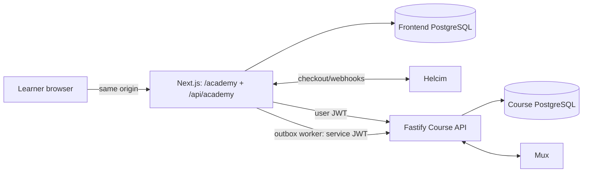

# Course Platform Cross-Repository Context — Frontend Side

> Mandatory reading for Academy, Course API, customer identity, course
> checkout, and entitlement-delivery work.

This defines the frontend side of the `lash-her-frontend` ↔
`lash-her-course-api` boundary. Also read the nearest `AGENTS.md` in every
repository changed. Current source, migrations, and Course API wire schemas
override historical plans. A disagreement between repositories is a contract
defect, not permission to choose one side silently.

## Ownership boundaries

The applications are separate services with separate PostgreSQL databases.
Neither may read or write the other's tables.

| Concern                | Authority and constraint                                                                                                               |
| ---------------------- | -------------------------------------------------------------------------------------------------------------------------------------- |
| Customer identity      | Frontend. `customer_users.id` is the learner ID and user-JWT `sub`; email, Google `sub`, and `admin_users.id` are not entitlement IDs. |
| Catalog and curriculum | Course API. Owns course ID, slug, status, price, currency, modules, lessons, and publication state.                                    |
| Payments               | Frontend. Owns Helcim, provider events, orders, course items, refunds, and financial history.                                          |
| Access                 | Course API. Owns the entitlement ledger, enrollment projection, and final access decision. A paid order is not active access.          |
| Entitlement delivery   | Frontend. Owns the durable outbox, retry, causal ordering, and repair emission.                                                        |
| Playback and progress  | Course API. Owns Mux assets, webhooks, signing, playback authorization, and progress.                                                  |
| Sanity                 | Public/editorial content only. It must not own price, access, progress, identity, payments, or learner activity.                       |
| In-person training     | `training_enrollments` are scheduling records and must never become online-course entitlements.                                        |

Online-course checkout is Helcim-only and CAD-only. Square remains a
service-booking and optional in-person-training concern. Helcim secrets stay in
the frontend; Mux secrets stay in the Course API.

## Architecture

- The public site, Academy, BFF, checkout routes, and Studio deploy together in
  the existing Next.js/Vercel application. Academy is not a separate release or
  rollback unit.
- Browsers call Next.js only. They must never call Fastify directly or receive
  Course API signing secrets.
- Server-rendered pages may call the Academy adapter directly; interactive
  browser operations use same-origin `/api/academy/**` routes.
- `src/lib/academy/course-api-adapter.ts` is the Academy-to-Course-API seam.
  `src/lib/course-api/**` is server-only.
- The frontend reaches the Course API only over HTTP. It has no Course API
  database connection and no Mux credentials.

## Infrastructure

- `COURSE_API_BASE_URL` must use HTTPS outside localhost and contain no
  credentials, query, or fragment.
- Auth.js, user-JWT, and service-JWT secrets must be distinct.

The deployments must match these values:

| Frontend                                     | Course API                                             |
| -------------------------------------------- | ------------------------------------------------------ |
| `COURSE_API_USER_JWT_SECRET/ISSUER/AUDIENCE` | `FIRST_PARTY_AUTH_SECRET/ISSUER/AUDIENCE`              |
| `COURSE_API_SERVICE_JWT_SECRET`              | One accepted `INTERNAL_SERVICE_JWT_SECRETS` value      |
| `COURSE_API_SERVICE_JWT_ISSUER/AUDIENCE`     | `INTERNAL_SERVICE_JWT_ISSUER/AUDIENCE`                 |
| `COURSE_API_SERVICE_JWT_SUBJECT`             | One `INTERNAL_SERVICE_JWT_ALLOWED_SUBJECTS` value      |
| `COURSE_API_SERVICE_JWT_TTL_SECONDS`         | Must not exceed `INTERNAL_SERVICE_JWT_MAX_TTL_SECONDS` |

The Course API supports overlapping service secrets for rotation; the frontend
signs with one active secret. Add the new verifier first, switch the signer,
wait for old tokens to expire, then remove the old verifier. User-JWT
verification has no equivalent overlap. The Course API user verifier also
retains a legacy `userId` fallback and does not enforce the frontend's intended
maximum TTL; require canonical `sub` and bounded TTL before production reliance.

Production must edge-restrict `/v1/internal/*` and `/metrics` while permitting
the Vercel worker. Course API origin/IP checks are defense in depth, not a
replacement for that restriction. Current frontend server fetches send no
`Origin` or `Referer`, so an origin-only allowlist rejects them. Use a verified
private/stable-egress path or define and test an explicit service-origin
contract; do not assume Vercel egress is stable. If origin and IP allowlists
are both configured, both checks must pass.

All course flags default to `false`:

- `ACADEMY_ENABLED` enables Course API configuration and Academy.
- `COURSE_CHECKOUT_ENABLED` enables checkout and requires Academy.
- `COURSE_ENTITLEMENT_WORKER_ENABLED` enables cron recovery and requires
  Academy. It does not disable the immediate post-payment delivery attempt.

Checkout can be enabled while recovery is disabled. Do not do this: failed
delivery would have no automatic recovery. Vercel calls the protected
`/api/cron/course-entitlements` route every minute; overlapping calls are
controlled with PostgreSQL leases and `FOR UPDATE SKIP LOCKED`. The route
requires `COURSE_ENTITLEMENT_CRON_SECRET` to be at least 32 characters and
distinct from Auth.js, both course JWT secrets, and `CRON_SECRET`. The shared
`CRON_SECRET` is secondary only and cannot enable the route by itself.

## Databases and migrations

Frontend PostgreSQL owns customer identity links, checkout/payment records,
course order-item snapshots, guest/refund records, and the entitlement outbox.
Course API PostgreSQL owns catalog/curriculum, its user projection,
entitlements/enrollments, playback metadata, and progress.

Migration `drizzle/0032_sloppy_rocket_raccoon.sql` introduced the frontend
course identity/order/outbox foundation. Apply it before deploying application
code containing the shared identity callback: Google sign-in resolves customer
identity even when `ACADEMY_ENABLED=false`. Feature flags do not remove this
schema dependency, and `next build` does not run migrations.

Frontend migration rules:

Generate and review forward migrations from `src/lib/private-db/schema.ts`,
commit SQL/snapshot/journal together, and apply to the intended database before
dependent code. Never edit an applied migration, use manual schema push, or
point frontend commands at the Course API database.

Frontend constraints validate each course item's ownership nullability, but do
not enforce equality between the order's and item's `customer_user_id`.
Application transactions currently maintain that relationship.

Course API schema changes use its `src/db/schema.ts`, immutable forward
migrations, database guards, and named database targets. Never point tests,
migrations, or seed commands at production Neon, and never seed production.

## Payments and entitlement delivery

1. `POST /api/checkout/course` requires a verified active customer and exact
   normalized session/request email match. Guest checkout is not exposed.
2. The frontend fetches the authoritative published course from the Course API
   and requires a valid ID, matching slug, positive price, and CAD currency.
   The Course API currently defaults new courses to USD, so purchasable courses
   must be explicitly configured as CAD.
3. It creates the Helcim session and atomically stores one pending order and
   course item. Checkout tokens are hashed; Helcim secrets are encrypted.
4. Browser validation or the trusted Helcim webhook finalizes payment. The
   trusted path requires approved purchase/capture status and exact
   transaction/order identity, amount, and currency. The webhook verifies its
   raw signature and deduplicates provider events. Browser validation does not
   enforce purchase/capture type as strictly; treat parity as a launch
   requirement.
5. Marking the order/item paid and inserting the grant outbox command is one
   frontend database transaction. Access may remain `processing`.
6. Immediate delivery is best effort; cron recovers pending jobs. The Course
   API applies commands idempotently and becomes authoritative for access.

The Helcim webhook remains `/api/webhooks/card-transactions` and must not be
changed to a path containing `helcim`.
The checkout token is a bearer capability; never log it or place it in an
unrelated URL.

Preserve these outbox invariants:

- Persist before delivery and send the same idempotency key in the body and
  `X-Idempotency-Key` header.
- Do not change emitted versioned key formats
  (`course-entitlement:<grant|revoke>:v1:<courseOrderItemId>:<userId>`) or
  payload hashing.
- Do not let a revoke overtake an incomplete grant for the same item.
- Course API mutations share one immutable idempotency namespace. Never reuse a
  key across command kinds, actors, scopes, or payloads.
- Validate that an entitlement response's `userId` and `courseId` match the
  command before recording success.
- Retry network/timeout/429/5xx failures; treat other 4xx responses as
  permanent. A 401/403 stops the batch because auth/network policy may be bad.
- Repair state with reviewable idempotent commands, never by deleting or
  rewriting payment, outbox, or Course API ledger history.

Production sales must remain disabled because these operations are incomplete:

- guest-claim code has no production route/UI;
- refund allocation and revoke construction have no production
  refund/dispute-to-revoke producer;
- reconciliation has no scheduled production caller.

These are not the complete launch checklist. Sales also require a connected
checkout handoff and usable learner course-list, playback, and progress flows.
Enable sales only after those flows plus migrations, network restrictions, cron
recovery, refund/revoke, reconciliation, and an end-to-end payment-to-access
smoke test are verified.

Frontend Course API contracts are handwritten runtime parsers with no generated
client or cross-repository compatibility CI. Any wire change must update Course
API schemas/OpenAPI and frontend parsers/consumers together, with an explicit
deployment order.
