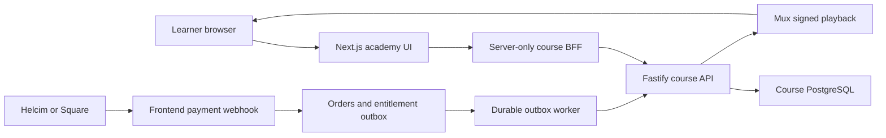

# Course Platform Integration Recommendation

**Date:** 2026-08-06  
**Status:** Proposed  
**Repositories assessed:** lash-her-frontend and lash-her-course-api

## Decision

Launch the first course frontend inside lash-her-frontend under an isolated
/academy route group, while keeping lash-her-course-api as a separate service
and database.

Treat academy.lashher.com as a later extraction decision. A hostname,
deployment, and codebase are separate choices; the implemented course API can
support either topology.

The proposed first-release shape is:

- Public discovery and checkout remain on lashher.com.
- The protected learner application is served at lashher.com/academy.
- Academy pages live under src/app/(academy)/academy with their own layout,
  separate from the marketing-site shell.
- A server-only backend-for-frontend (BFF) under src/lib/course-api and
  /api/academy calls the Fastify service.
- Browser components never receive course JWT signing secrets or internal
  service credentials.
- The frontend never reads the course database directly.
- The existing training_enrollments table is not reused for online-course
  access.

## Rationale

This is the lower-risk MVP for four reasons:

1. The existing frontend already owns checkout, payment verification,
   payment-provider webhooks, private orders, guest linkage, and the future
   entitlement outbox. The course API explicitly assigns those
   responsibilities to lash-her-frontend.
2. The current frontend authentication is staff/admin-oriented and has no
   canonical customer identity. A separate academy application would add SSO,
   login/logout coordination, and multi-origin testing before that shared
   identity model exists.
3. The course API is already an independent service boundary. Hosting the
   initial learner UI in the existing Next.js repository does not require
   merging course data, progress, playback, or entitlement ownership into the
   frontend.
4. Current training enrollment records represent paid intro-call scheduling,
   notification, and token state. They are not LMS enrollments and should
   remain separate.

## Target architecture

### Ownership boundaries

| Concern                                                                | Owner                                            |
| ---------------------------------------------------------------------- | ------------------------------------------------ |
| Public sales/editorial presentation                                    | Sanity and lash-her-frontend                     |
| Authoritative course ID, status, price, currency, modules, and lessons | lash-her-course-api                              |
| Customer identity and account linkage                                  | First-party identity implemented by the frontend |
| Checkout, provider webhooks, orders, and refunds                       | lash-her-frontend                                |
| Grant/revoke delivery and reconciliation emission                      | lash-her-frontend outbox                         |
| Entitlement ledger and active enrollment projection                    | lash-her-course-api                              |
| Mux upload authorization, playback authorization, and progress         | lash-her-course-api                              |
| Learner UI and BFF                                                     | Initially lash-her-frontend                      |

Sanity may store course sales copy and artwork keyed by an immutable course API
courseId. It must not become the source of truth for course price, entitlement,
progress, learner identity, or private activity.

## Current readiness assessment

### Course API capabilities already implemented

The Fastify API contains:

- Public published-course listing and detail routes.
- Admin course, module, and lesson creation and editing.
- Enrollment-gated student course and lesson routes.
- Monotonic lesson progress recording.
- Mux direct upload creation, raw-body webhook verification, and signed
  playback authorization.
- Internal idempotent grant, revoke, access-check, and read-only
  reconciliation contracts.
- Audited admin grant, revoke, and entitlement-inspection contracts.
- PostgreSQL migrations, unit and contract tests, integration-test coverage,
  Prometheus metrics, alert rules, and operational runbooks.

### Course API gaps affecting frontend integration

- There is no GET /v1/student/courses or equivalent "my courses" endpoint.
  The learner dashboard cannot rely on frontend orders because manual,
  promotional, and imported grants may exist only in the course service.
- The API validates bearer JWTs but does not implement login, cookies,
  sessions, refresh, or token exchange.
- Lesson content is one unspecified text field plus Mux video. There are no
  quizzes, certificates, captions, downloads, attachments, or assessments.
- There is no generated frontend client or cross-repository contract
  compatibility check, although OpenAPI output exists.
- Preview lesson metadata is public, but preview detail/playback currently
  still requires an authenticated user.
- Student access behavior for draft and archived courses needs an explicit
  product rule.
- There is no committed production hosting manifest or dependency-aware
  readiness endpoint.
- Admin video status is not exposed through a dedicated read contract.

### Frontend gaps

- No canonical customer user or external-identity mapping tables.
- The Auth.js session exposes provider identity for staff flows, not an
  immutable application customer ID.
- No customer signup, login, recovery, or verified account-linking flow.
- No course API client, BFF, or course environment configuration.
- Checkout orders do not have canonical customer IDs or normalized course
  order items.
- Existing line items are JSON snapshots and do not provide stable
  course-line identifiers for partial refunds.
- No entitlement outbox, delivery worker, retry/cancellation workflow, or
  nightly course reconciliation.
- Square refund evidence is stored, but it is not currently translated into
  course-line revocations. Helcim handling is focused on approved payments.

## Topology comparison

| Concern           | Existing app at /academy                               | Dedicated academy.lashher.com app                                      |
| ----------------- | ------------------------------------------------------ | ---------------------------------------------------------------------- |
| Customer identity | One application session and BFF                        | Requires central SSO or a token-exchange control plane                 |
| Checkout handoff  | Same-origin and directly linked to orders              | Cross-application activation and deep-link flow                        |
| Deployments       | Next.js frontend plus Fastify API                      | Two frontend deployments plus Fastify API                              |
| Release isolation | Course UI deploys with marketing and commerce          | Independent academy releases and rollback                              |
| Security          | Fewer auth surfaces; broader frontend secret footprint | Better runtime isolation but a larger SSO/configuration surface        |
| SEO               | Public course pages remain on the apex domain          | Public pages should still remain on the apex domain                    |
| Testing           | Primarily single-origin                                | Login, logout, consent, callbacks, and deep links across origins       |
| Initial effort    | Baseline                                               | Higher due to SSO, deployment, observability, and cross-origin testing |

## Implementation plan

### Phase 0 — Product and infrastructure decisions

Record the following decisions before schema or UI work:

1. Determine whether online-course access is:
   - A standalone digital product.
   - Included with an existing in-person training program.
   - Both.

   Do not automatically grant academy access for current training purchases
   until this relationship is explicit.

2. Make the course API authoritative for courseId, publication state, price,
   currency, curriculum, entitlement, and progress.

3. Standardize MVP currency, likely CAD. The course API permits other
   currencies and its seed uses USD, while current checkout is CAD-oriented.

4. Define the MVP content model. If quizzes, certificates, captions, PDFs, or
   downloads are launch requirements, expand the API before building the
   learner UI.

5. Choose the Fastify deployment and network path:
   - Node 24 container-capable runtime.
   - Separate course PostgreSQL database.
   - HTTPS and managed secrets.
   - Public rejection of /v1/internal/\* and /metrics.
   - A private or allow-listed path for the entitlement worker.

6. Replace the documented in-process outbox-worker assumption. This
   repository runs scheduled work through HTTP cron routes rather than a
   persistent process. Use either:
   - A durable queue/workflow, or
   - A database-leased worker with immediate dispatch and periodic recovery.

### Phase 1 — Stabilize the course API contract

Implement in lash-her-course-api:

- Add GET /v1/student/courses with active courses and aggregate progress.
- Define learner access rules for draft, published, and archived courses.
- Decide whether preview playback is public or only enrollment-free.
- Define the lesson content format and sanitization rules.
- Add admin-readable video status if authoring UI is launch scope.
- Add stable OpenAPI operation IDs.
- Export a deterministic complete OpenAPI artifact.
- Generate frontend types/client code and add a cross-repository CI
  compatibility check.
- Add a dependency-aware readiness endpoint.
- Package and deploy the API to staging with PostgreSQL, Mux, edge
  restrictions, metrics, and alerts.

### Phase 2 — Customer identity and BFF

Implement in lash-her-frontend:

- Add application-generated immutable customer IDs.
- Add provider-account mappings and verified-email linkage rules.
- Expose the canonical ID as session.user.id.
- Keep admin_users as a staff authorization/RBAC overlay.
- Do not use Google subject, email, or an admin row ID as the course userId.
- Define signup, login, recovery, and guest-order claim behavior.
- Mint short-lived course-audience JWTs only on the server.
- Use distinct secrets for Auth.js sessions, course user JWTs, and internal
  service JWTs.
- Add courses:view/manage and course-entitlements:view/manage permissions.
- Create a server-only src/lib/course-api client with timeouts, typed errors,
  correlation IDs, and redacted logging.
- Expose only a same-origin BFF to learner components.

Extraction constraints:

- Academy pages use a dedicated route group and layout.
- Browser components never call the Fastify API directly.
- Academy code does not import checkout, Sanity-loader, or marketing-shell
  internals.
- API types come from the generated contract.
- Academy URLs are generated through configuration rather than hardcoded.

### Phase 3 — Purchase-to-entitlement lifecycle

Add normalized frontend tables:

- course_order_items:
  - Stable line-item ID.
  - Checkout order ID.
  - Course API UUID.
  - Price and currency snapshot.
  - Canonical user ID or guest state.
  - Refund/dispute state.
- entitlement_outbox:
  - Grant or revoke payload.
  - Unique idempotency key.
  - Pending, processing, completed, failed, or cancelled status.
  - Attempt count, lease, retry time, and last error.
  - Returned grant ID and completion timestamp.
  - Manual cancellation actor, reason, and time.
- Guest-order claim/link records.
- Refund-allocation records for partial refunds.

Required behavior:

- Resolve price and availability server-side.
- Persist provider-event claim, order transition, refund allocation, and
  outbox insertion in one PostgreSQL transaction.
- Document exact authoritative Helcim/Square paid, refund, dispute,
  chargeback, and reversal events.
- Emit one grant or revoke per course order item.
- Preserve causal ordering so a revoke cannot overtake its pending grant.
- Defer guest grants until a verified account owns the order.
- Deliver commands with the API service JWT and matching X-Idempotency-Key.
- Retry timeouts, rate limits, and server errors.
- Fail and alert on validation, authentication, or idempotency collisions.
- Run nightly read-only reconciliation and emit approved repairs through the
  same outbox.
- Provide staff inspection, retry, and audited cancellation.

### Phase 4 — Learner experience

Build the isolated academy shell:

- Dashboard with owned courses, progress, and "continue learning".
- Course overview with module and lesson navigation.
- Lesson view with Mux player, written content, completion, and resume
  position.
- Throttled monotonic progress writes rather than writes on every playback
  event.
- Explicit UI states for:
  - Payment received and access processing.
  - Course API unavailable.
  - Video processing.
  - Access revoked.
  - Course archived.
  - Empty dashboard.

- Mark authenticated academy pages noindex.
- Keep public discovery and checkout on the apex domain.

### Phase 5 — Admin and operations

Add to the existing /admin application:

- Course, module, and lesson editing.
- Mux upload and processing status.
- Entitlement and enrollment inspection.
- Audited manual grants and revocations.
- Failed outbox inspection, retry, and cancellation.
- Reconciliation results and approved repair actions.

Do not assign the broad courseAdmin claim to every existing staff account.

### Phase 6 — Verification and rollout

Required launch evidence:

- The same immutable user ID appears in the session, order item, outbox,
  entitlement, and progress records.
- Duplicate provider events and worker retries create one grant.
- Guest payment creates no grant before verified account linkage.
- Partial refund revokes only the affected course item.
- Refund-before-grant delivery is processed in causal order.
- Revoked users cannot obtain new playback tokens; existing tokens expire
  within ten minutes.
- Unauthorized users cannot read paid lesson content or write progress.
- Public traffic cannot reach internal entitlement endpoints or metrics.
- Contract generation fails CI on incompatible API changes.
- Real staging Mux upload, webhook, signed playback, and token refresh work.
- Grant latency meets P95 under 60 seconds and P99 under five minutes.
- Feature-flag rollout progresses through internal orders, limited production
  traffic, and full release only after clean reconciliation and monitoring.

## Conditions for choosing a dedicated academy app

Choose academy.lashher.com as a separate application before implementation
only if at least two of the following are already true:

- A separate course team needs an independent release cadence.
- Academy availability or rollback requirements differ materially from the
  public site.
- Security policy requires learner-runtime isolation from payment and checkout
  secrets.
- The roadmap includes assessments, certificates, community, cohorts,
  offline/PWA support, or other application-scale LMS features.
- The course platform will represent a large share of future frontend work.
- Operating a central identity issuer and another production deployment is
  acceptable.

If extraction occurs later:

- Keep public marketing and checkout on lashher.com.
- Move only the authenticated learner shell to academy.lashher.com.
- Give the academy app its own BFF and host-only secure session.
- Use a central authorization-code/token-exchange flow rather than sharing a
  broad .lashher.com session cookie.
- Do not allow the academy application to read the frontend operational
  database.

## Evidence and verification

Relevant frontend evidence:

- [Auth.js configuration](../src/auth.ts)
- [Admin-only route protection](../src/proxy.ts)
- [Private database schema](../src/lib/private-db/schema.ts)
- [Training enrollment store](../src/lib/commerce/training-enrollment-store.ts)
- [Vercel cron configuration](../vercel.json)

Relevant course API evidence:

- lash-her-course-api/README.md
- lash-her-course-api/src/courses/course.routes.ts
- lash-her-course-api/src/courses/student.routes.ts
- lash-her-course-api/src/video/video.routes.ts
- lash-her-course-api/src/entitlements/entitlement.routes.ts
- lash-her-course-api/src/auth/first-party.ts
- lash-her-course-api/src/http/openapi.ts
- lash-her-course-api/docs/payment-course-access/

During the assessment, the course API verification suite passed:

- TypeScript compilation.
- ESLint.
- 227 unit and contract tests.
- Drizzle migration-journal validation.
- Generated-schema drift validation.

The opt-in PostgreSQL integration suite and a live Mux environment were not
rerun as part of the assessment.
