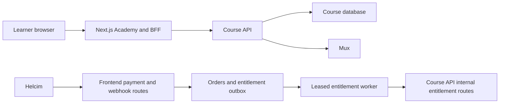

# The worktree contains a substantial production-safety foundation, but not a launch-complete learner product. The primary Course API blocker is the missing authoritative learner-course collection. Course lifecycle rules, stable error codes, generated contracts, and production deployment also need completion.

Helcim should remain in `lash-her-frontend`. The Course API should not receive card data, Helcim webhooks, checkout tokens, or refund APIs.



## Course API work required

### 1. Add the authoritative learner dashboard endpoint

Add:

`GET /v1/student/courses`

This is the main missing runtime contract. The frontend cannot derive Academy ownership from checkout orders because manual, promotional, imported, or administrative grants may exist only in the Course API.

Requirements:

- Authenticate with the user bearer JWT.
- Derive the user exclusively from JWT `sub`; do not accept `userId` in the query or body.
- Return `200 {"courses":[]}` for a learner with no courses.
- Select courses from active entitlement/enrollment state, not payment records.
- Include aggregate progress and a continuation target.
- Use deterministic ordering and eventually cursor pagination.

Recommended response shape:

```json
{
  "courses": [
    {
      "id": "course-uuid",
      "slug": "classic-lash-foundations",
      "title": "Classic Lash Foundations",
      "description": null,
      "status": "published",
      "progress": {
        "totalLessons": 12,
        "completedLessons": 4,
        "percentComplete": 33,
        "lastActivityAt": "2026-08-07T10:00:00Z",
        "continueLessonId": "lesson-uuid",
        "continuePositionSeconds": 318
      }
    }
  ]
}
```

The current API only exposes individual course, lesson, playback, and progress operations in [student.routes.ts](/Users/dardan/workspace/lash-her-course-api/src/courses/student.routes.ts:65). The frontend therefore deliberately renders an empty-contract state on the [Academy dashboard](</Users/dardan/workspace/lash-her-frontend/.worktrees/course-platform-integration/src/app/(academy)/academy/(protected)/page.tsx:7).

### 2. Define and enforce course lifecycle rules

The current student routes load a course by ID without checking whether it is draft, published, or archived. Preview lesson and playback paths can also bypass enrollment without first enforcing course status.

Apply one consistent policy to:

- `GET /v1/student/courses/:courseId`
- `GET /v1/student/courses/:courseId/lessons`
- `GET /v1/student/lessons/:lessonId`
- `GET /v1/student/lessons/:lessonId/playback`
- `GET /v1/student/progress`
- `POST /v1/student/lessons/:lessonId/progress`

A safe MVP policy is:

| Course state | Learner behavior                                                                             |
| ------------ | -------------------------------------------------------------------------------------------- |
| `draft`      | Hidden from learners and previews; return `404 COURSE_NOT_FOUND`                             |
| `published`  | Active enrollment required, except for an explicitly supported preview                       |
| `archived`   | Include a dashboard summary if useful, but return `410 COURSE_ARCHIVED` for content/playback |

If archived purchasers should retain access, model that explicitly. Do not use “archived” both for “not sold anymore” and “content access removed”; those are different business states.

Preview policy also needs a decision. Currently preview content and playback are enrollment-free but still require an authenticated user. If public previews are wanted, add a separate rate-limited public endpoint rather than weakening student routes.

### 3. Add stable domain error codes

The Course API currently returns generic codes such as `FORBIDDEN` and `CONFLICT`. The frontend currently interprets any `403` as revoked access and loosely matches strings such as “archived” and “video_processing” in [course-api-adapter.ts](/Users/dardan/workspace/lash-her-frontend/.worktrees/course-platform-integration/src/lib/academy/course-api-adapter.ts:131).

Add stable codes:

|    HTTP | Code                         | Meaning                               |
| ------: | ---------------------------- | ------------------------------------- |
|     403 | `ACTIVE_ENROLLMENT_REQUIRED` | Learner has no qualifying entitlement |
|     403 | `ENTITLEMENT_REVOKED`        | Previously granted access was revoked |
|     404 | `COURSE_NOT_FOUND`           | Missing or draft-hidden course        |
|     404 | `LESSON_NOT_FOUND`           | Missing or inaccessible lesson        |
|     410 | `COURSE_ARCHIVED`            | Archived content is unavailable       |
|     409 | `VIDEO_PROCESSING`           | Video is not ready                    |
| 409/422 | `VIDEO_UNAVAILABLE`          | Video processing failed               |

`PAYMENT_ACCESS_PROCESSING` should remain frontend-owned. The Course API does not know whether a Helcim payment or outbox grant is still processing.

### 4. Stabilize and generate the API contract

The frontend currently has hand-written types and runtime parsers in [contracts.ts](/Users/dardan/workspace/lash-her-frontend/.worktrees/course-platform-integration/src/lib/course-api/contracts.ts:23). They fail safely at runtime, but cross-repository drift is not detected before deployment.

The Course API should:

- Add stable OpenAPI `operationId` values.
- Generate a deterministic complete OpenAPI artifact.
- Check that artifact into the Course API repository.
- Generate frontend TypeScript types and validators from it.
- Add compatibility CI between the two repositories.
- Fail CI on breaking response, authentication, enum, or error-code changes.

The current OpenAPI document is generated dynamically only in [openapi.ts](/Users/dardan/workspace/lash-her-course-api/src/http/openapi.ts:5).

### 5. Align authentication and network configuration

The following values must match exactly:

| Frontend                         | Course API                                                      |
| -------------------------------- | --------------------------------------------------------------- |
| `COURSE_API_USER_JWT_SECRET`     | `FIRST_PARTY_AUTH_SECRET`                                       |
| `COURSE_API_USER_JWT_ISSUER`     | `FIRST_PARTY_AUTH_ISSUER`                                       |
| `COURSE_API_USER_JWT_AUDIENCE`   | `FIRST_PARTY_AUTH_AUDIENCE`                                     |
| `COURSE_API_SERVICE_JWT_SECRET`  | Member of `INTERNAL_SERVICE_JWT_SECRETS`                        |
| Service issuer/audience          | `INTERNAL_SERVICE_JWT_ISSUER` / `INTERNAL_SERVICE_JWT_AUDIENCE` |
| `COURSE_API_SERVICE_JWT_SUBJECT` | Member of `INTERNAL_SERVICE_JWT_ALLOWED_SUBJECTS`               |

User JWT `sub` must be the immutable frontend `customer_users.id`, not an email, Google subject, Auth.js token subject, or admin ID.

The internal network policy also needs deployment alignment. If `INTERNAL_SERVICE_ALLOWED_ORIGINS` is used, the current server-to-server frontend client does not send an `Origin` header. Prefer private networking, mTLS, or static egress/IP restrictions; otherwise explicitly align the client and API policy.

The frontend sends `X-Request-ID`, but the Course API does not currently configure Fastify to adopt or echo it. That should be added for cross-service tracing.

### 6. Add production readiness and a deployable service definition

The current `/health` endpoint always returns `{status:"ok"}`. Add `/ready` or `/health/ready` with a bounded database check and `503` when unavailable.

Production completion requires:

- A Node 24 deployment/container manifest.
- Separate PostgreSQL 16 database.
- Applied migrations and startup compatibility checks.
- Managed Mux and JWT secrets.
- HTTPS.
- Restricted `/v1/internal/*` and `/metrics`.
- Real staging Mux upload, webhook, playback, and token-refresh verification.
- Metrics, alerts, log correlation, and backup/restore evidence.

No production hosting manifest currently exists beyond the test compose file.

### 7. Complete admin authorization before adding the frontend admin UI

The Course API currently accepts broad `admin`/`courseAdmin` roles, metadata flags, or an ID allowlist. The frontend defines narrower permissions:

- `courses:view`
- `courses:manage`
- `course-entitlements:view`
- `course-entitlements:manage`

The Course API should enforce those signed permission claims per route. A generic admin role should not automatically grant course entitlement mutation rights.

If authoring UI is in launch scope, also add an admin-readable video status endpoint or include sanitized video status in the admin lesson contract.

### Existing Course API contracts that can be retained

These already substantially match the frontend:

- Public published-course list/detail.
- Enrollment-gated course and lesson detail.
- Monotonic progress recording.
- Signed Mux playback authorization.
- `POST /v1/internal/entitlements/grants`
- `POST /v1/internal/entitlements/revocations`
- `GET /v1/internal/entitlements`
- `POST /v1/internal/entitlements/reconcile`
- Audited admin entitlement grant/revoke/inspection.

The internal entitlement routes already enforce matching header/body idempotency keys and collision detection in [entitlement.routes.ts](/Users/dardan/workspace/lash-her-course-api/src/entitlements/entitlement.routes.ts:167).

No new Course API Helcim or refund endpoint is required. Refund allocation remains frontend-owned; the existing revocation endpoint is sufficient once the frontend emits an item-specific revoke command.

## Current Academy/course-platform extension features

### Existing Course API baseline

The separate service already provides:

- Published course catalog and detail.
- Course/module/lesson creation and updates for administrators.
- Enrollment-gated learner content.
- Preview lesson behavior.
- Monotonic progress and completion records.
- Mux direct uploads, signed webhook processing, and ten-minute playback tokens.
- Idempotent entitlement grant, revoke, check, and reconciliation contracts.
- Audited administrative entitlement commands and inspection.
- PostgreSQL migrations, metrics, alerts, tests, and operational runbooks.

### Worktree additions

| Area                       | Current implementation                                                                                                       | Current boundary                                               |
| -------------------------- | ---------------------------------------------------------------------------------------------------------------------------- | -------------------------------------------------------------- |
| Customer identity          | First-party customer UUID, Google provider mapping, verified-email ownership, uniqueness/race handling, disabled-user checks | Google-only; no recovery or provider-link UI                   |
| Academy shell              | Isolated `/academy` layout, `noindex`, Node runtime, safe sign-in return URLs                                                | No sign-out control                                            |
| Academy security           | Verified session, live active-customer checks, server-only JWT minting, fixed-operation BFF                                  | Feature remains disabled by default                            |
| Learner pages              | Direct course and lesson pages, plain-text lesson content, completion labels                                                 | Dashboard cannot discover courses                              |
| BFF                        | Course, lesson, playback, and progress routes with no-store responses and sanitized errors                                   | No learner-course collection route                             |
| Cross-course authorization | Verifies that a lesson belongs to the route’s course before content, playback, or progress                                   | Requires an extra course read                                  |
| Course checkout            | Authenticated one-course checkout, authoritative Course API pricing, CAD-only Helcim invoice and Pay session                 | No public React checkout/discovery UI                          |
| Payment finalization       | Browser and signed webhook paths converge on an atomic course finalizer                                                      | Browser completion only redirects to a processing placeholder  |
| Helcim webhook             | Signature verification, transaction-detail retrieval, purchase/capture checks, amount/currency matching, duplicate detection | Refund/reversal evidence is stored but not allocated           |
| Persistence                | Canonical customer IDs, normalized course items, guest claims, refund allocations, durable entitlement outbox                | Migration is generated but not applied to a target environment |
| Entitlement delivery       | One-job immediate dispatch, leased five-job recovery, retries, backoff, payload integrity, causal command sequencing         | No staff inspection/retry/cancel UI or reconciliation runner   |
| Feature gates              | Academy, checkout, and worker can be enabled independently                                                                   | All default to off                                             |
| Administration             | Permission vocabulary added                                                                                                  | No course/outbox/customer administration pages                 |

Key implementation files include the [identity resolver](/Users/dardan/workspace/lash-her-frontend/.worktrees/course-platform-integration/src/lib/customer-identity/resolver.ts:28), [course checkout](/Users/dardan/workspace/lash-her-frontend/.worktrees/course-platform-integration/src/lib/course-commerce/course-checkout.ts:83), [atomic lifecycle repository](/Users/dardan/workspace/lash-her-frontend/.worktrees/course-platform-integration/src/lib/course-commerce/drizzle-lifecycle-repository.ts:35), and [entitlement worker](/Users/dardan/workspace/lash-her-frontend/.worktrees/course-platform-integration/src/lib/course-commerce/entitlement-worker.ts:143).

The implementation is therefore a functional backend foundation with protected deep links. It is not yet a complete learner UI:

- `/academy` shows “Course library connection pending.”
- The lesson player is a [placeholder boundary](/Users/dardan/workspace/lash-her-frontend/.worktrees/course-platform-integration/src/components/academy/playback-boundary.tsx:1).
- No client component currently posts progress.
- Modules are flattened into one lesson list.
- Payment-processing query parameters are not interpreted by the dashboard.
- Guest claiming is backend-only.
- Refund-to-revoke is schema/command infrastructure only.
- No non-test component currently calls `/api/checkout/course`.

## Lessons learned

1. **The immutable customer UUID is the integration spine.** Email and Google subject are linkage evidence, not entitlement ownership. The same UUID must flow through session, order, course item, outbox, Course API entitlement, playback, and progress.

2. **Verified email is not sufficient for automatic account linking.** Reassigned domains and recycled addresses can transfer an email to another person. A previously unseen provider subject must not claim an existing customer solely by matching email.

3. **JWT sessions cannot enforce immediate account disablement.** An eight-hour session can retain a valid customer ID after the database row is disabled. Academy and checkout boundaries therefore need live active-user checks.

4. **Payment completion and entitlement delivery are different consistency domains.** Helcim evidence, order transition, course-item transition, and outbox insertion can be one local transaction. The remote Course API grant cannot, so it must be idempotent and recoverable.

5. **Payment status alone is unsafe.** Approved refunds and reversals exist. Transaction type and original transaction identity must be retained so an approved refund is never mistaken for an approved purchase.

6. **A partial refund cannot identify a course item from its amount.** Stable normalized order items and an explicit allocation record are required before emitting revocation.

7. **Serverless recovery requires leases, not an in-process loop.** Worker lease duration must account for the full sequential batch, not one API timeout. Expired final-attempt leases also need a terminal, inspectable state.

8. **Browser callbacks must not poison trusted recovery.** A malformed or premature browser callback must not make an otherwise valid course order unrecoverable before the signed Helcim webhook arrives.

9. **Route IDs are not authorization.** Before serving a lesson or playback token, the frontend verifies that the lesson belongs to the enrolled course. This prevents cross-course identifier substitution.

10. **Feature flags must stop work before authentication or database access.** Disabled routes should not require secrets, create users, or touch databases.

11. **A route group does not automatically create runtime isolation.** Separating the Academy required moving Sanity, marketing shell, cart, consent, and draft-mode dependencies into the public-site layout.

12. **Real migration execution catches failures schema tests miss.** The composite verified-email foreign key required its supporting unique index to exist first. Applying the entire migration chain to a clean PostgreSQL instance was necessary evidence.

13. **Runtime validators are useful but not a substitute for generated contracts.** The current frontend fails safely on malformed Course API responses, but deployment-time compatibility remains absent.

14. **Passing local tests is not launch evidence.** The build, 1,741 unit tests, and clean 33-migration audit validate the repository. They do not validate staging networking, real Helcim duplication, Mux token refresh, revoked access, reconciliation, or latency targets.

## Expansion and improvement opportunities

### Frontend priorities

1. Implement the audited item-explicit Helcim refund/dispute operation:
   - Claim the provider event.
   - Allocate it to a course item.
   - Update accumulated refund and financial status.
   - Insert the sequence-2 revoke command atomically.
   - Revoke on full refund/dispute according to an explicit policy.
   - Never infer allocation solely from amount.

2. Apply the private-database migration in staging and add real cross-service integration tests.

3. Build public course discovery and signed-in checkout UI using authoritative server-side price and publication state.

4. Add an authenticated activation-status endpoint combining:
   - Local order/payment state.
   - Outbox state.
   - Course API entitlement check.

   This should drive “payment received,” “access processing,” “ready,” and “manual follow-up” UI.

5. Replace the playback placeholder with a Mux player that:
   - Fetches authorization only when needed.
   - Refreshes before token expiry.
   - Never stores tokens persistently.
   - Throttles monotonic progress updates.
   - Supports resume and explicit completion.

6. Add operational outbox tooling: failed-job inspection, audited retry/cancel, durable authentication circuit breaker, alerts, nightly reconciliation, and approved repair commands.

7. Add account recovery, provider linking, verified guest-order claim, customer disable/reactivate, and identity-conflict audit tooling.

8. Harden commerce further:
   - Add checkout-initialization idempotency.
   - Reconcile orphaned Helcim invoices if database persistence fails.
   - Require/fetch authoritative transaction type in the browser completion path.
   - Bound payment callback and raw webhook body sizes.
   - Sanitize finalization error logging.
   - Enforce Helcim transaction uniqueness across all checkout purposes.

9. Define retention/anonymization rules for course orders, claims, outbox payloads, progress linkage, and refund evidence.

10. Improve Academy UX: real dashboard, module hierarchy, continue-learning, unavailable/not-found states, sign-out, accessible loading/error states, and progress feedback.

### Course API expansion opportunities

- Admin-readable video status, duration, captions, and processing errors.
- Versioned Markdown or structured lesson content with an explicit sanitization contract.
- Captions, transcripts, downloads, and attachment authorization.
- Quizzes, assessments, prerequisites, certificates, and completion rules.
- Time-limited entitlements if subscriptions or expiring access are introduced.
- Course bundles, cohorts, drip schedules, and scheduled availability.
- Public preview playback through a separate bounded endpoint.
- Cursor pagination and catalog search when course/enrollment counts justify them.
- Fine-grained admin permission claims and immutable admin audit events.
- Stronger service authentication through asymmetric signing/JWKS or mTLS.
- Correlated traces and explicit service-level objectives for grant latency, playback authorization, and progress writes.

The approved plan remains accurately reflected in [course-platform-integration-recommendation.md](/Users/dardan/workspace/lash-her-frontend/.worktrees/course-platform-integration/docs/course-platform-integration-recommendation.md:1).
